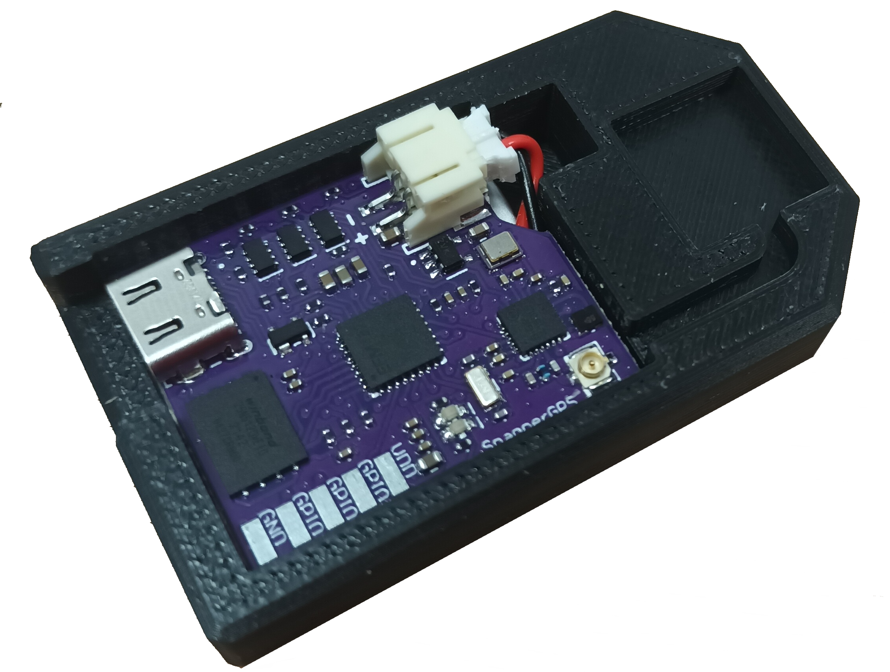
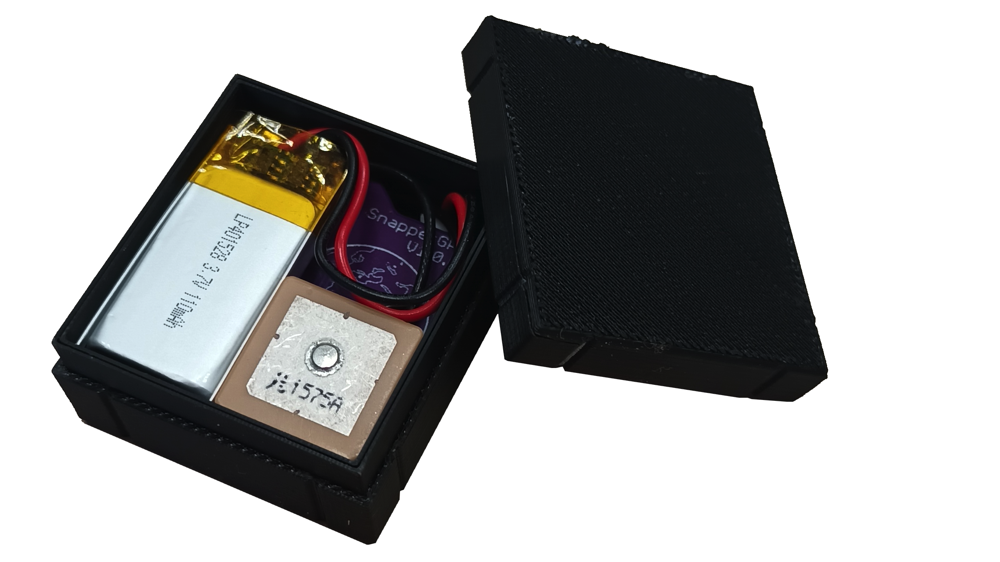
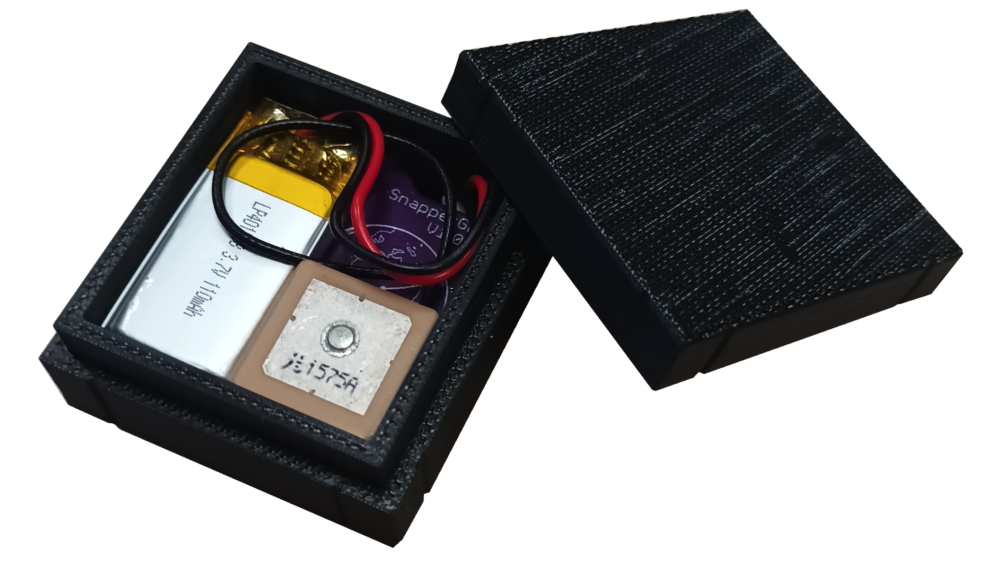
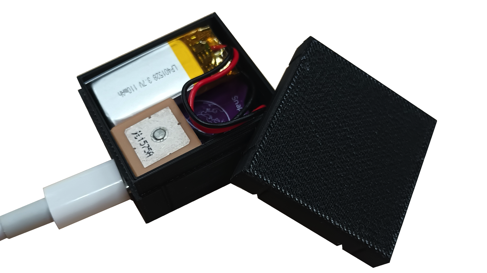
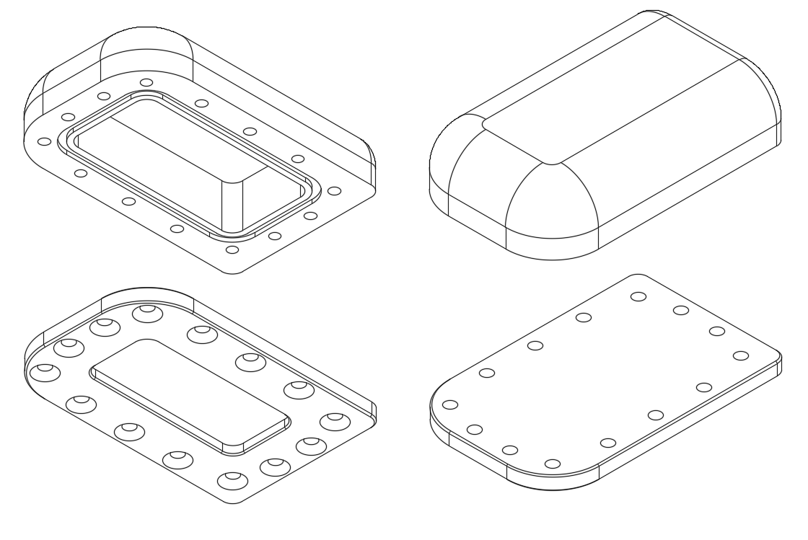
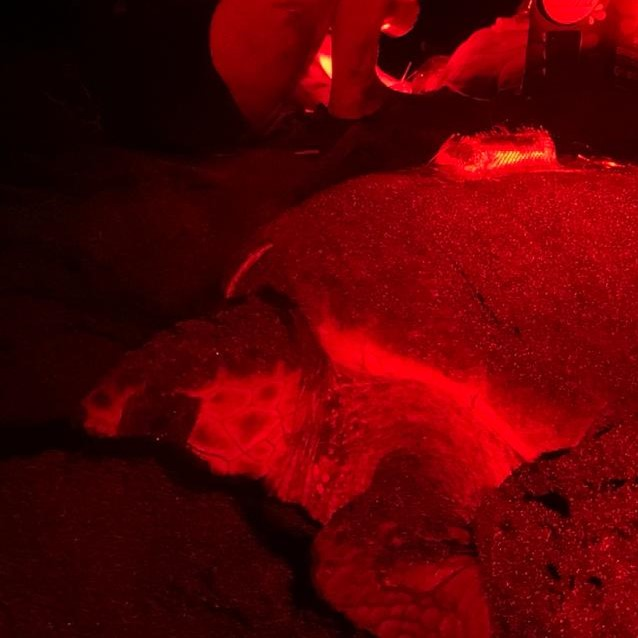

# snappergps-housings

This repository contains different housing designs intended to provide some protection for [a SnapperGPS PCB](https://github.com/SnapperGPS/snappergps-pcb/), a battery, and an antenna during testing.

All designs are designed to be 3D-printed.
If you want to use any of these designs for a long-term deployment, we advise you to carefully consider whether the material is suitable for the deployment environment.
It might be possible to make the housings more suitable by applying a finish to the outer surface.
Other housing options for packaging a SnapperGPS PCB for a deployment, which are not part of this repository, include:
* Heat shrink tubing (light-weight and waterproof),
* Vacuum packing (light-weight and waterproof),

### Table of contents

  * [Tray](#tray)
  * [Thin box](#thin-box)
  * [Thick box](#thick-box)
  * [Box with cut-outs](#box-with-cut-outs)
  * [Turtle case](#turtle-case)

## Tray

The tray holds a SnapperGPS PCB, a flat battery, and an *APAM1368YB13V3.0* active GNSS antenna in place.

## Thin box

The box holds a SnapperGPS PCB, a battery, and an active GNSS antenna, e.g., an *Echo 27* or an *APAM1368YB13V3.0*, in place and can be closed with a lid.

## Thick box

The same as the [thin box](thin-box), but with twice the wall thickness.

## Box with cut-outs

The same as the [thin box](thin-box), but with two cut-outs to attach a USB cable and to monitor the status LED without opening the box.

## Turtle case

This is a design for a waterproof enclosure (if machined out of waterproof materials). It requires 14 countersunk 10 mm M4 screws, such as [these from RS-Online](https://uk.rs-online.com/web/p/socket-screws/2328388). You will also need a 59 mm (inner diameter) x 2mm (cross-section) o-ring such as [this one from Polymax](https://www.polymax.co.uk/o-ring-59mm-id-x-2mm-cs-epdm-70-sha).

You can design your own inserts based on the antenna and battery you are using. Alternatively, you can make a cut-out from a thick piece of packaging foam. Cut it slightly oversized so the components sit snugly when the enclosure is closed. Make sure that the tag cannot jiggle around in the tag.

If you machine any piece of the housing out of metal, ensure that none of the electrical components can come in touch with it to avoid shorts.

A version machined out of polyoxymethylene (for the top) and aluminium (for the baseplate) has been successfully deployed on nesting loggerhead sea turtles.

You can find more information on deploying SnapperGPS on (sea) turtles in [this dicussion](https://github.com/orgs/SnapperGPS/discussions/4).

