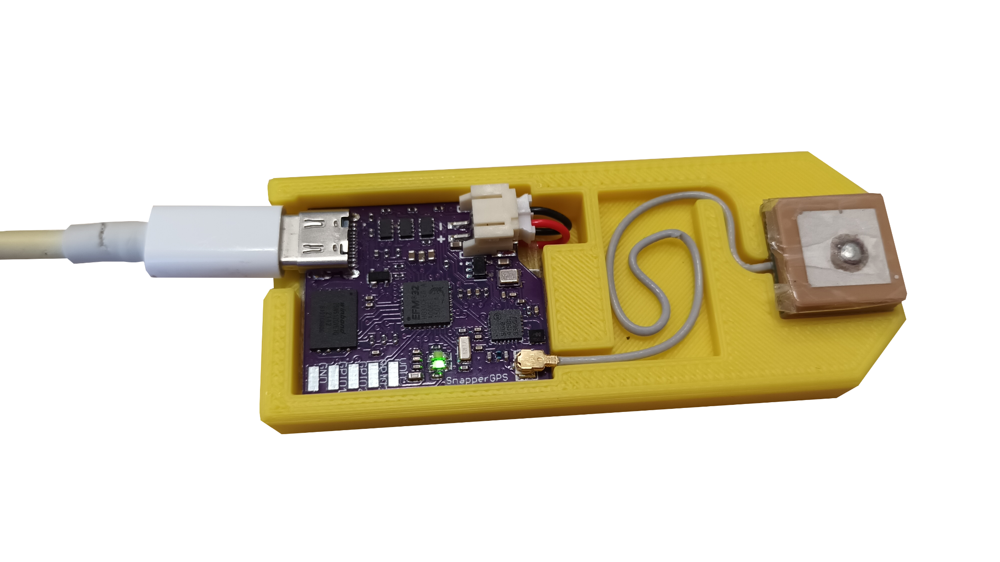
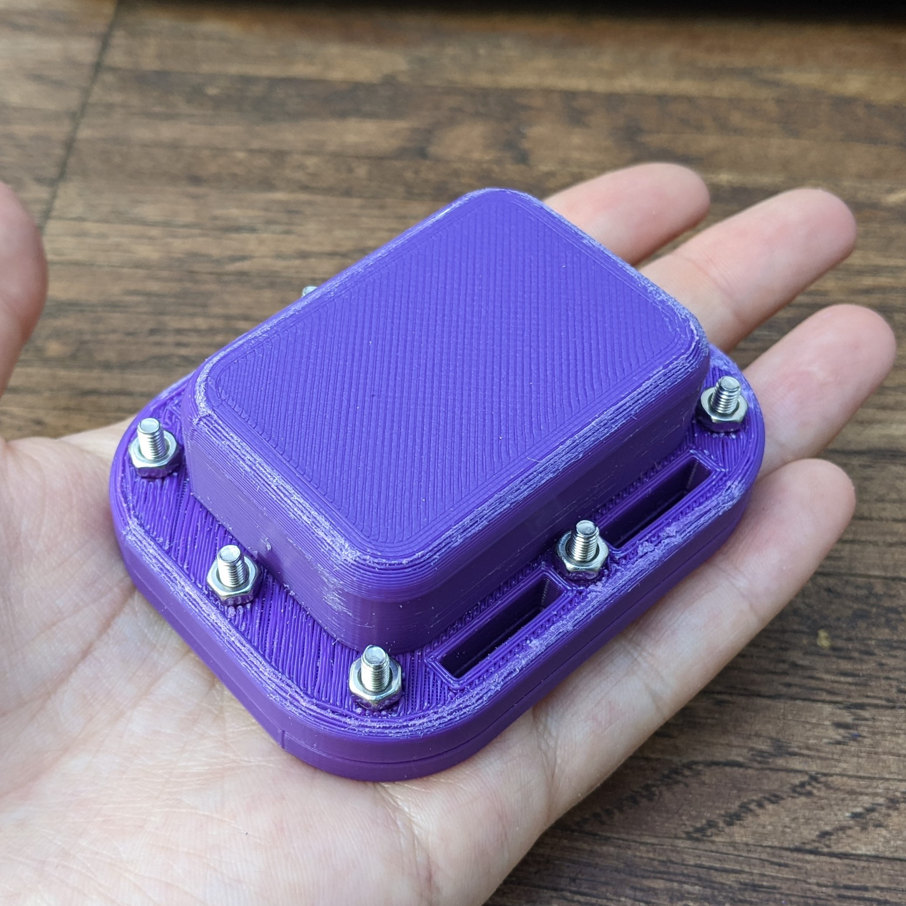
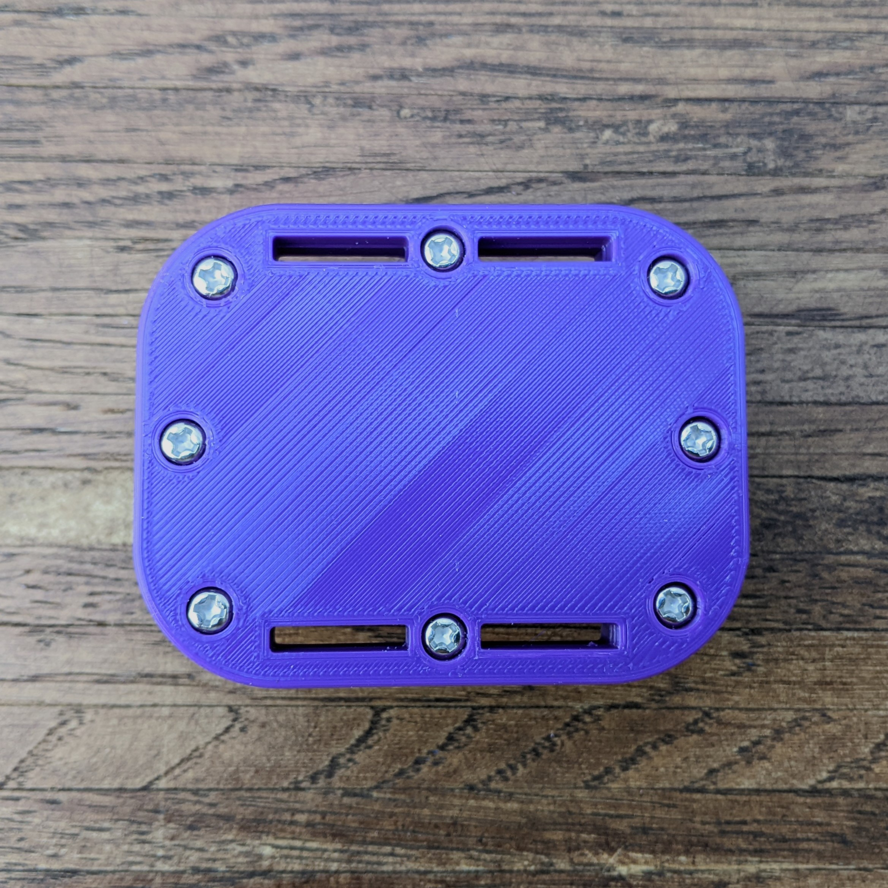
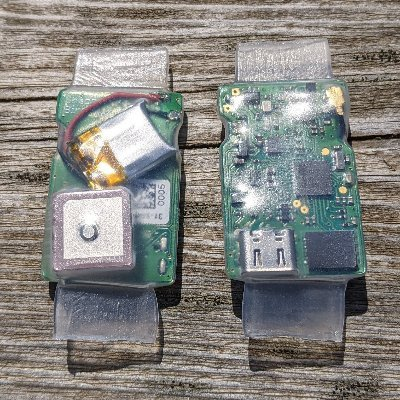
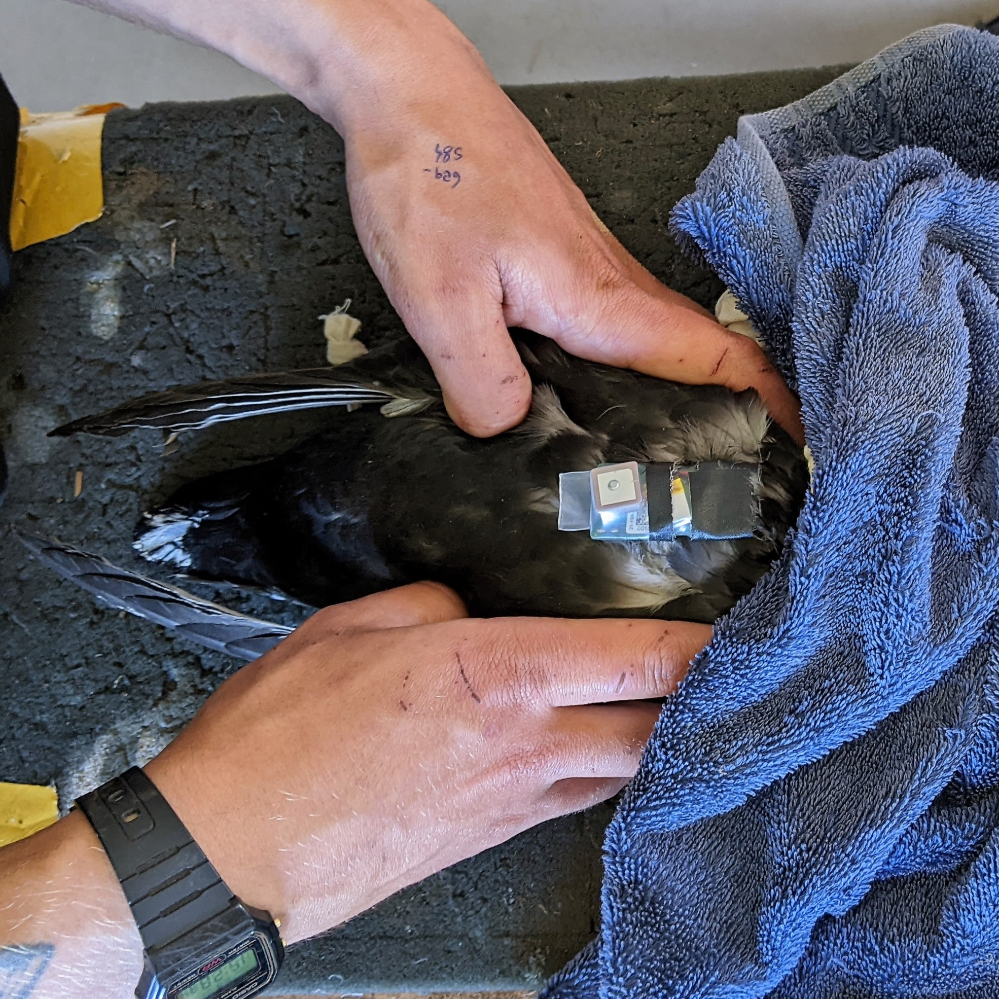

# snappergps-housings

This repository contains different housing designs intended to provide some protection for [a SnapperGPS PCB](https://github.com/SnapperGPS/snappergps-pcb/), a battery, and an antenna during testing.

Most designs (but not all) are intended to be 3D-printed.
If you want to use any of these designs for a long-term deployment, we advise you to carefully consider whether the material is suitable for the deployment environment.
It might be possible to make the housings more suitable by applying a finish to the outer surface.

Other housing options for packaging a SnapperGPS PCB for a deployment include:
* [Heat-shrink tubing](#heat-shrink-tubing) (light-weight, low-cost, and waterproof), and
* [Vacuum packing](#vacuum-packing) (light-weight, low-cost, and waterproof).

To avoid creating an electrical short, we suggest to ensure that none of the components in the enclosure (PCB, battery, antenna) directly touches another one. For example, this can be done by putting some tape on the components if they would otherwise make direct contact.

### Table of contents

  * [Tray (APAM1368YB13V3.0)](#tray-apam1368yb13v30)]
  * [Tray (Echo 27 V2)](#tray-echo-27-v2)
  * [Thin box](#thin-box)
  * [Thick box](#thick-box)
  * [Box with cut-outs](#box-with-cut-outs)
  * [Turtle case](#turtle-case)
  * [Waterproof case without threads](#waterproof-case-without-machined-threads)
  * [Heat-shrink tubing](#heat-shrink-tubing)
  * [Vacuum packing](#vacuum-packing)
  * [Acknowledgements](#acknowledgements)

## Tray (APAM1368YB13V3.0)

The tray holds a SnapperGPS PCB, a flat battery, and an *APAM1368YB13V3.0* active GNSS antenna in place.

## Tray (Echo 27 V2)

The tray holds a SnapperGPS PCB, a flat battery, and an *Echo 27 V2* active GNSS antenna in place.

## Thin box

The box holds a SnapperGPS PCB, a battery, and an active GNSS antenna, e.g., an *Echo 27* or an *APAM1368YB13V3.0*, in place and can be closed with a lid.

## Thick box

The same as the [thin box](thin-box), but with twice the wall thickness.

## Box with cut-outs

The same as the [thin box](thin-box), but with two cut-outs to attach a USB cable and to monitor the status LED without opening the box.

## Turtle case

This is a design for a waterproof enclosure (if machined out of waterproof materials). It requires 14 countersunk 10 mm M4 screws, such as [these from RS-Online](https://uk.rs-online.com/web/p/socket-screws/2328388). You will also need a 59 mm (inner diameter) x 2mm (cross-section) o-ring such as [this one from Polymax](https://www.polymax.co.uk/o-ring-59mm-id-x-2mm-cs-epdm-70-sha).

You can design your own inserts based on the antenna and battery you are using. Alternatively, you can make a cut-out from a thick piece of packaging foam. Cut it slightly oversized so the components sit snugly when the enclosure is closed. Make sure that the tag cannot jiggle around in the tag.

If you machine any piece of the housing out of metal, ensure that none of the electrical components can come in touch with it to avoid shorts.

A version machined out of polyoxymethylene (for the top) and aluminium (for the baseplate) has been successfully deployed on nesting loggerhead sea turtles.

You can find more information on deploying SnapperGPS on (sea) turtles in [this dicussion](https://github.com/orgs/SnapperGPS/discussions/4).

## Waterproof case without machined threads

This design is a smaller and simpler version of the turtle tag. Instead of using machined threads, this design uses nuts to seal the case.

For this version, I had some 15 mm M3 Phillips Pan Head screws and nuts left over [from this set](https://www.amazon.co.uk/gp/product/B08789D7M5). But if you have access to Fusion, you can also edit the .f3d file to fit other types of screws. I recommend getting nuts with nyloc inserts. They won't come undone as easily.

You will also need an o-ring with 2 mm cross-section and 48 mm internal diameter. I used [this one from Polymax](https://www.polymax.co.uk/o-ring-sizes-48mm-id-x-2mm-cs-nitrile-70-sha-fda).

As before, I recommend cutting an oversized piece of packaging foam to hold the components in place. Make sure that the electronic components cannot jiggle around or short out by touching each other. I used insulation tape and double-sided tape to glue all the parts together. This makes the components easy to handle and prevents accidental shorts as well as unnecessary stress on the antenna and battery connector.

 

This repo contains a version with loop holes (pictured) and one without. The photos show a model 3D-printed out of PLA. As such it won't dive-proof but it's still a very sturdy, weather-proof case that you can cable tie to your backpack/bike/boat/flying car.

For a waterproof case, we recommend CNC machining the top out of polyoxymethylene (POM) and the plate out of aluminium (beware of shorting out the electronics).

## Heat-shrink tubing

[Heat-shrink tubing](https://en.wikipedia.org/wiki/Heat-shrink_tubing) is a light-weight, low-cost, and waterproof way to enclose a SnapperGPS receiver for deployments where no sturdy housing is required.
For this, you need heat-shrink tubing that is wide enough to fit a SnapperGPS receiver.
(A SnapperGPS receiver has a width of 27.3 mm and a length of 32 mm.)
Cut a tube that is about 2 cm longer than a SnapperGPS receiver and place a receiver in the tube.
Next, heat the tube, e.g., using a hot air gun, a lighter, or an oven, until the tube has shrunk and wrapped around the receiver.
Finally, use hot pliers, a curling iron, or something similar to seal both ends of the tube.

## Vacuum packing

[Vacuum packing](https://en.wikipedia.org/wiki/Vacuum_packing) is a light-weight, low-cost, and waterproof way to enclose a SnapperGPS receiver for deployments where no sturdy housing is required.
For this, you need vacuum sealer machine / vacuum packing machine.
It can be a low-cost machine like one of those that can be used for food sealing at home.

## Acknowledgements

SnapperGPS is developed by
[Jonas Beuchert](https://users.ox.ac.uk/~kell5462/),
[Amanda Matthes](https://amanda-matthes.github.io/), and
[Alex Rogers](https://www.cs.ox.ac.uk/people/alex.rogers/)
in the Department of Computer Science
of the University of Oxford.

Jonas Beuchert and Amanda Matthes are
funded by the EPSRC Centre for Doctoral Training in
Autonomous Intelligent Machines and Systems
(DFT00350-DF03.01, DFT00350-DF03.05) and develop
SnapperGPS as part of their doctoral studies.
The implementation of SnapperGPS 
was co-funded by an EPSRC IAA Technology Fund
(D4D00010-BL14).
